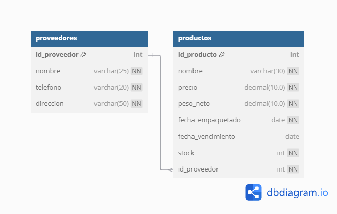

En este trabajo creamos una base de datos, que está diseñada para gestionar la información de los proveedores y productos de
una tienda de mascotas.

Esta base de datos cuenta con **2 entidades**: `proveedores` y `productos`.
Su relación es **1 a N**, es decir, un proveedor puede suministrar muchos productos, pero cada producto tiene un solo proveedor.

### La entidad `proveedores` está compuesta por los siguientes atributos:
- `id_proveedor` (PRIMARY KEY)
- `nombre`
- `telefono`
- `dirección`

### La entidad `productos` cuenta con los siguientes atributos:
- `id_producto` (PRIMARY KEY)
- `nombre`
- `precio`
- `peso_neto`
- `fecha_empaquetado`
- `fecha_vencimiento`
- `stock`
- `id_proveedor` (FOREIGN KEY)

